# FlavorGo

## Restaurant Ordering Platform

  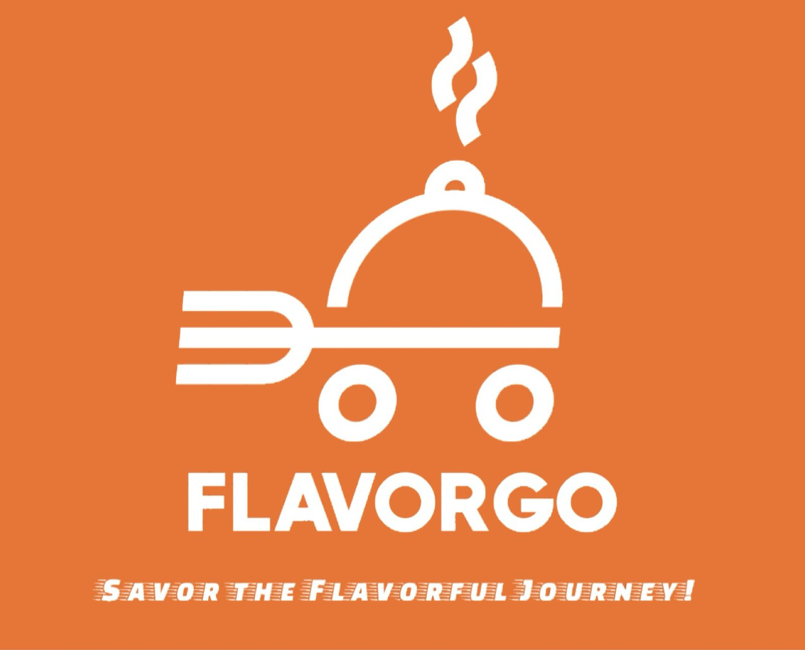

  FlavorGo is a restaurant ordering platform that allows users to explore restaurants, browse meals, add items to cart, manage orders, and submit feedback through a clean and interactive interface.

  
  
  
  
  
  

  <a href="#overview">Overview</a> •
  <a href="#features">Features</a> •
  <a href="#project-pages">Project Pages</a> •
  <a href="#technologies-used">Technologies Used</a> •
  <a href="#team-members">Team Members</a> •
  <a href="#future-improvements">Future Improvements</a> •
  <a href="#screenshots">Screenshots</a>

---

## 📌 Overview

FlavorGo is a web-based restaurant ordering platform designed to provide users with a smooth and visually appealing food ordering experience.

The system enables users to:

- Explore featured restaurants and offers
- Browse restaurant menus and meal categories
- Add meals to cart and manage quantities
- Review selected items before checkout
- Submit ratings and feedback after ordering

The platform also includes owner-side pages for managing restaurant content such as offers and cuisine items.

---

## 🚀 Key Features

- Restaurant browsing interface
- Featured offers section
- Meal listing with categories
- Add to cart functionality
- Cart management page
- Checkout and order confirmation flow
- Restaurant evaluation and rating page
- Owner dashboard for managing restaurant content
- Add new offers page
- Add new cuisine page
- Light / dark mode support
- Consistent UI design across all pages

---

## 📄 Project Pages

### Customer Side

- **Home Page**  
Displays featured offers, reviews, and the main landing interface.

- **Restaurants Page**  
Shows the list of restaurants available for users.

- **Restaurant Details Page**  
Displays meals, categories, pricing, calories, and add-to-cart actions.

- **Cart Page**  
Allows users to review selected items, adjust order details, and proceed to checkout.

- **Evaluation Page**  
Lets users rate their experience and submit feedback after placing an order.

### Owner Side

- **Owner Dashboard**  
Main management page for restaurant content.

- **Offers Management Page**  
Displays existing offers and allows adding or deleting offers.

- **Add Cuisine Page**  
Allows the owner to add new meal items with image, calories, price, and description.

---

## 🛠 Technologies Used

- **HTML5** – page structure  
- **CSS3** – styling and layout  
- **JavaScript** – interactivity and page logic  
- **LocalStorage** – temporary client-side data storage

---

## 👥 Team Members

- Rahaf Alfantoukh
- Hadeel Almutairi  

---

## 🔮 Future Improvements

Possible future enhancements include:

- Backend database integration
- User authentication system
- Real payment gateway support
- Search and filtering functionality
- Order history page
- Mobile responsiveness improvements
- Admin dashboard analytics
- Advanced restaurant management tools

---

## 📸 Screenshots

### 🏠 Home Page

  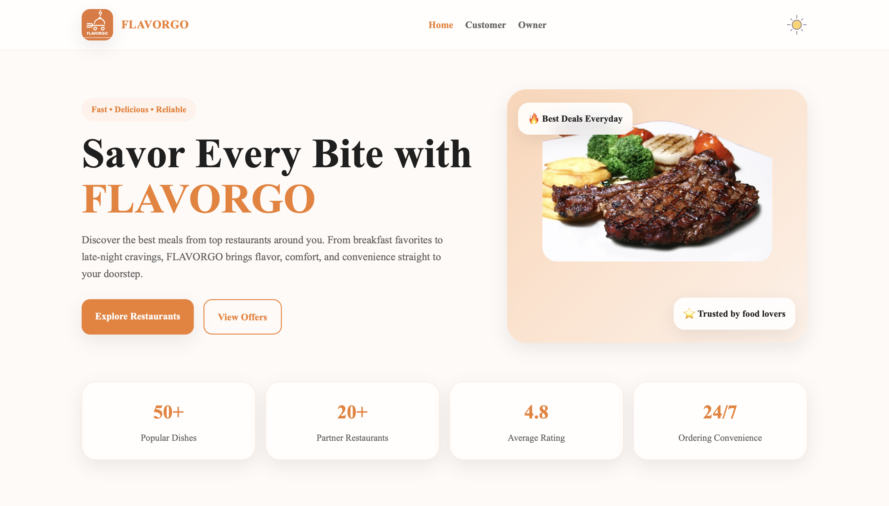
  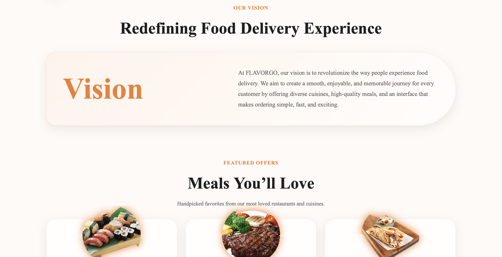
  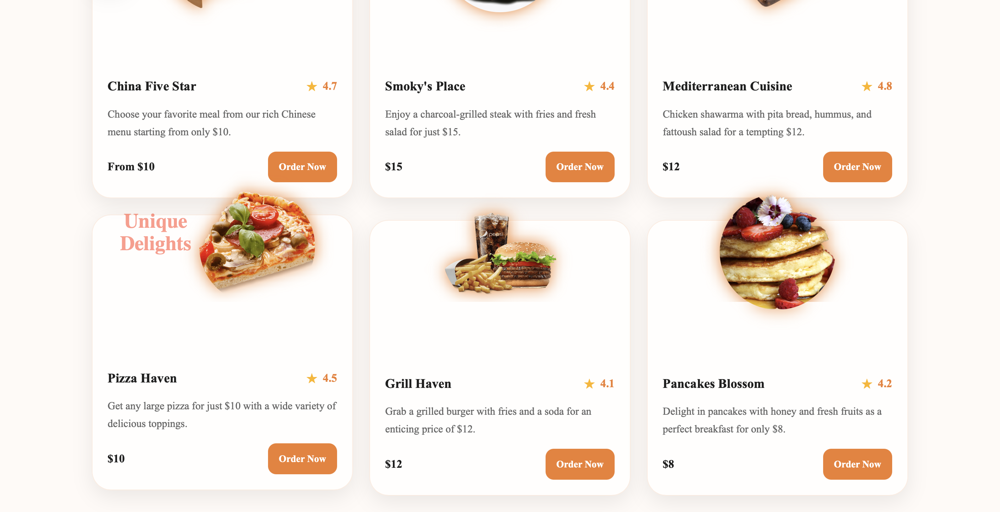
  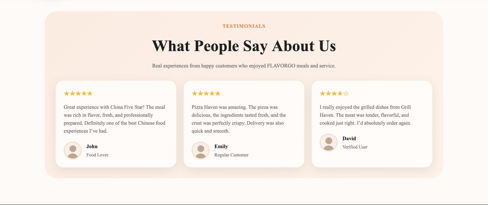
  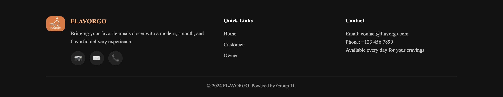
  

### 🍽️ Restaurants Page

  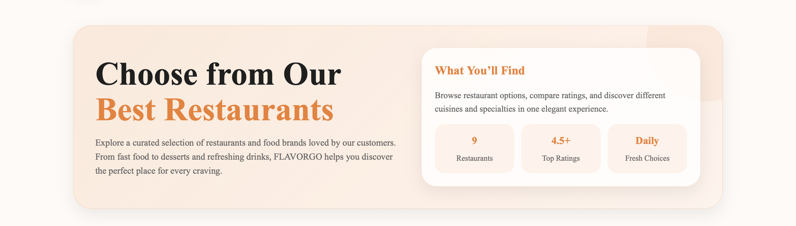
  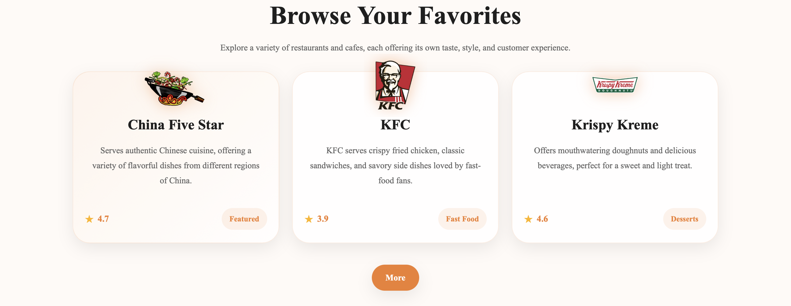

### 📋 Restaurant Details Page

  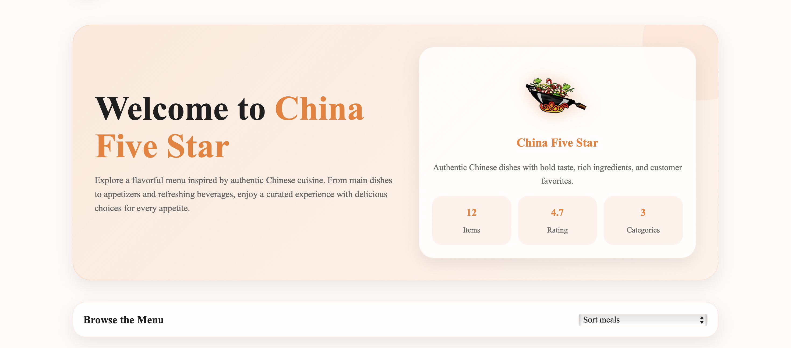
  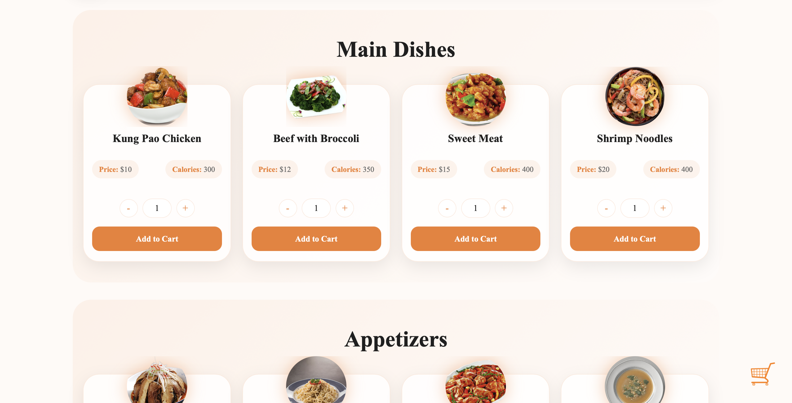

### 🛒 Cart Page

  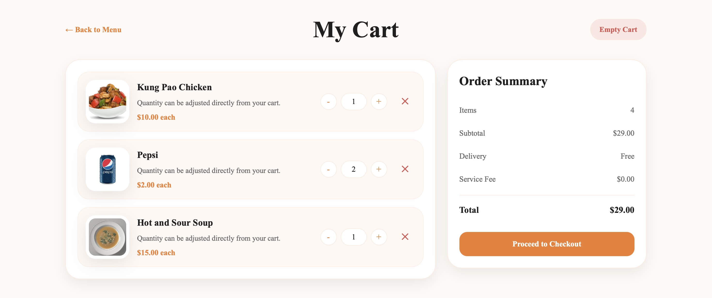

### ⭐ Evaluation Page

  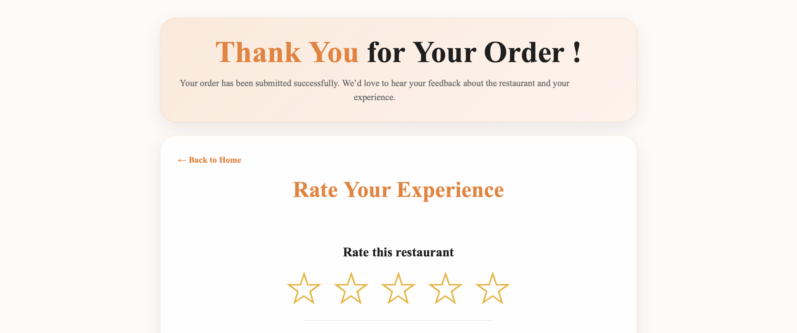
  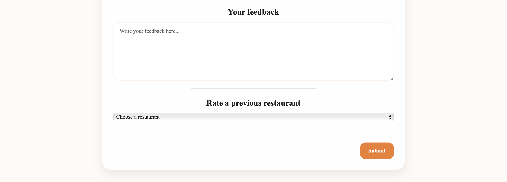

### 🧑‍💼 Owner Dashboard

  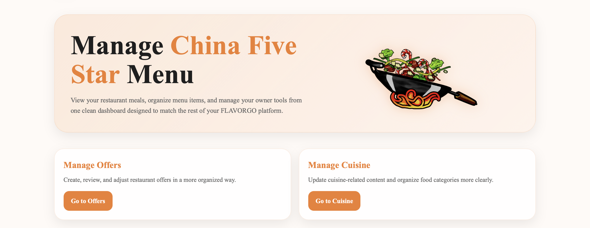

